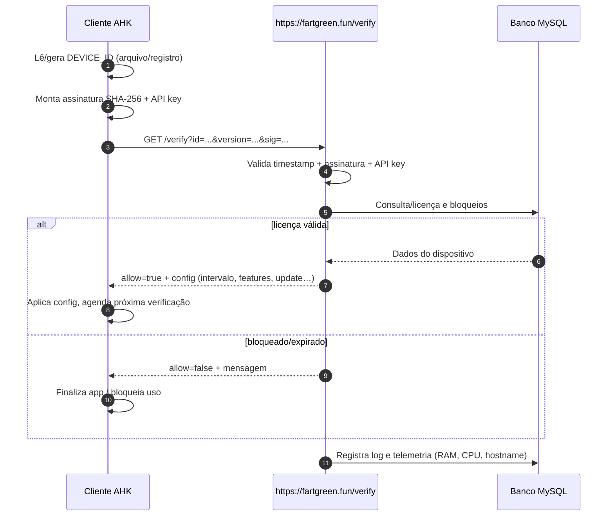

# Guia Completo – Instalação, Arquitetura e Testes

## 1. Arquitetura

```mermaid
flowchart LR
    subgraph Cliente (Windows/AHK)
        A[main.exe (AHK)] --> B[device_id.ahk]
        A --> C[request.ahk]
        C -->|HTTP GET /verify| S((Servidor PHP))
    end

    subgraph Servidor fartgreen.fun
        S --> D[(MySQL)]
        S --> E[Logs/Telemetria]
    end

    D <-->|Consultas/Atualizações| S
```

## 2. Fluxo do processo



## 3. Guia de instalação

### 3.1 Servidor (https://fartgreen.fun)

1. **Criar banco MySQL**
   ```sql
   CREATE DATABASE licencas CHARACTER SET utf8mb4 COLLATE utf8mb4_unicode_ci;
   ```
2. **Importar schema**
   ```bash
   mysql -u usuario -p licencas < server/database.sql
   ```
3. **Configurar `server/config.php`**
   - `DB_DSN`, `DB_USER`, `DB_PASSWORD`
   - `API_KEY` e `SHARED_SECRET` (iguais aos do cliente)
   - Ajuste dos prazos (`$LICENSE_PERIODS`) se necessário.
4. **Publicar arquivos**
   - Copie todo o conteúdo de `/server` para o diretório público do site.
   - Verifique se `https://fartgreen.fun/verify` responde (ex.: 400 sem parâmetros).
5. **Criar registros**
   - Insira linhas em `devices` com `device_id`, `license_type`, `start_date`.
   - Use `blocked_devices` para bloquear rapidamente IDs indevidos.
6. **Logs**
   - A tabela `access_logs` receberá todos os acessos.
   - Utilize `license_history` para auditoria manual (opcional).

### 3.2 Cliente (Windows + AutoHotkey)

1. **Configurar dependências**
   - AutoHotkey v1 instalado para desenvolver/compilar.
2. **Editar `ahk-client/device_id.ahk`**
   - Ajuste `g_DeviceIdDefaults` se quiser outro caminho ou storage.
3. **Editar `ahk-client/request.ahk`**
   - `g_RequestConfig.baseUrl` deve ser `https://fartgreen.fun`.
   - Configure `apiKey` e `sharedSecret` iguais aos do servidor.
4. **Editar `ahk-client/main.ahk`**
   - Ajuste `APP_VERSION`.
   - Configure `Request_SetConfig` (API key/segredo) se desejar colocar dados via `.ini`.
5. **Compilar**
   - Abra `main.ahk` → use Ahk2Exe para gerar `main.exe`.
   - Distribua `main.exe` para cada computador (suggestion: colocar em `%ProgramFiles%`).

6. **Primeira execução**
   - O script criará `C:\ProgramData\MyApp\device.id` e registrará em `HKCU\Software\MyApp`.
   - Será enviado o primeiro `/verify`. Caso o ID não exista e `ALLOW_AUTO_PROVISION=false`, cadastre manualmente no banco.

### 3.3 Segurança recomendada

- Use HTTPS obrigatório (já configurado via fartgreen.fun).
- Alterne a cada cliente um `api_key` diferente (coluna customizada na tabela ou outra instância).
- Habilite logs e monitoramento do servidor web (fail2ban, WAF, etc).
- Opcional: mover `verify.php` para subcaminho protegido e usar proxy inverso.

## 4. Guia de testes

1. **Teste de fluxo feliz**
   - Inserir `device_id` com licença `mensal`, status `active`.
   - Rodar `main.exe` → deve mostrar tooltip/mensagem de sucesso e manter app aberto.
2. **Bloqueio manual**
   - Adicionar ID em `blocked_devices` ou mudar `status` para `blocked`.
   - Executar cliente novamente → deve encerrar com mensagem “Licença bloqueada”.
3. **Expiração automática**
   - Ajustar `end_date` para ontem.
   - Cliente deve acusar “Licença expirada”.
4. **Assinatura inválida**
   - Trocar `sharedSecret` no cliente para outro valor.
   - Servidor deve retornar 403 e logar tentativa.
5. **Timeout/queda de rede**
   - Desligar servidor ou bloquear firewall.
   - Cliente registra `NET_FAIL` e (por padrão) mostra aviso sem liberar uso.
6. **Teste de atualizações**
   - Preencher colunas `update_url`, `update_hash`, `update_version` no `devices`.
   - Cliente deve baixar arquivo para `update-*.exe` e registrar `UPDATE_READY`.

## 5. Integração futura

- **Painel Web**: conectar-se ao banco para listar `devices`, status, logs e permitir bloqueio com 1 clique.
- **API adicional**: adicionar endpoints REST para CRUD de licenças e painel SPA.
- **Notificações**: publicar eventos no Slack/Discord sempre que um bloqueio for acionado.


